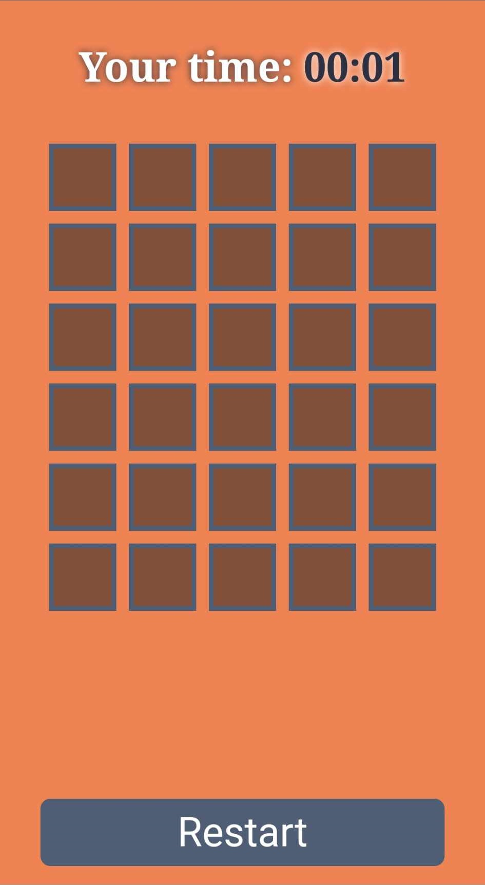
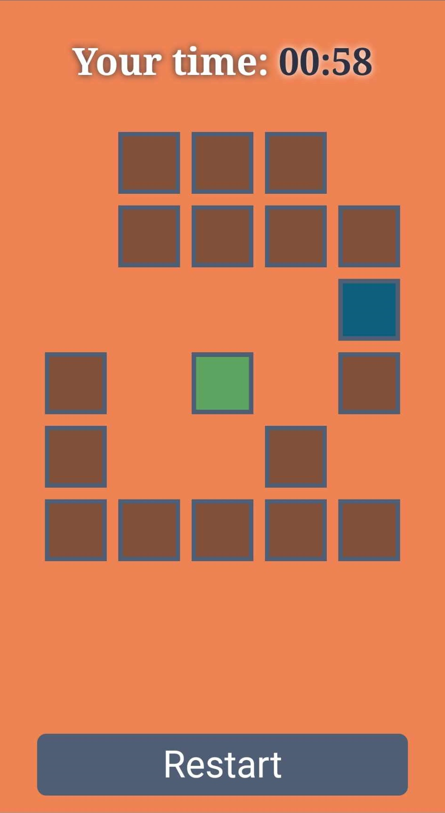
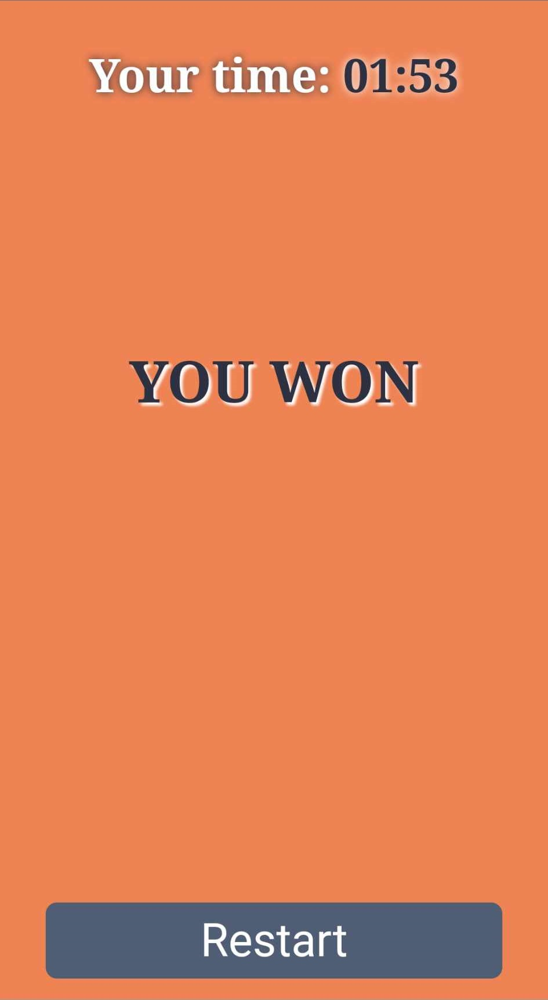

# Memory-Color-Master
Memory Color Master created by Patryk 'UltiPro' Wójtowicz using JavaScript jQuery.

Memory Color Master is a game written in JavaScript jQuery. The game involves discovering and remembering colors in order to match them. The game has a timer and a restart button.

# Usage

Link to game: [click](https://ultipro.github.io/Memory-Color-Master/)

# Preview

    
    
    

